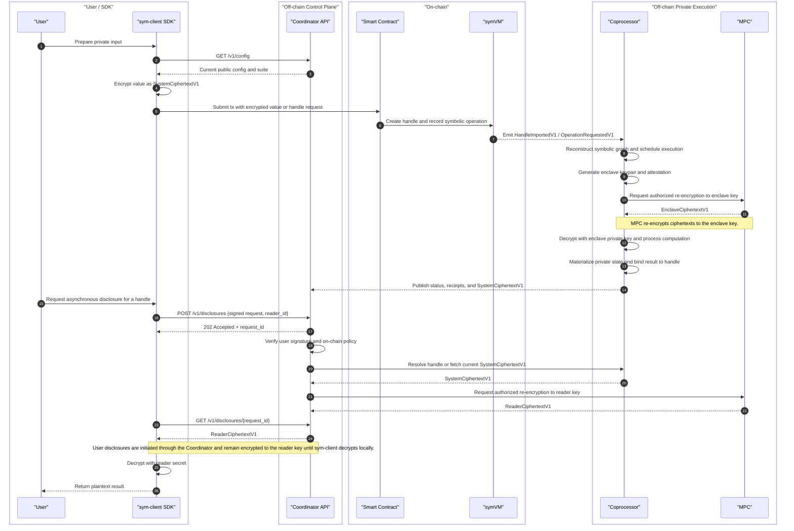

# Symbolic Execution Specifications

`Symbolic Execution` specifies a model for private, composable execution on
Ethereum.

The model is informed by
[ERC-7984](https://eips.ethereum.org/EIPS/eip-7984): private values appear
on-chain as opaque references, compose across contracts, and are realized
asynchronously off-chain.

## Core Model

Private computation on Ethereum looks like a native contract primitive.

That means:

- private values appear on-chain as opaque handles rather than plaintext
- contracts can express operations over those values
- private state can compose across applications
- private execution can happen off-chain while the contract-facing abstraction
  remains stable

## Architecture Modules

The architecture has five pieces:

- `sym-client`: SDK that prepares private inputs, manages reader keys, and
  receives authorized outputs
- `symVM`: exposes private handles and symbolic operations on-chain
- `Coordinator`: off-chain control plane for authorization, async request
  tracking, and routing between services
- `Coprocessor`: resolves symbolic work off-chain
- `MPC`: provides threshold key custody and ciphertext transformation

## High-Level Flow

Execution split:

- `sym-client` encrypts user inputs before transactions are submitted on-chain.
- `symVM` records symbolic intent on-chain and emits the canonical event
  surface consumed by the `Coprocessor`.
- `Coordinator` is the off-chain entrypoint for user-facing async requests. It
  verifies signatures, checks policy, tracks request state, and routes work to
  the `Coprocessor` and `MPC`.
- private computation happens inside the coprocessor enclave.
- `MPC` handles threshold key operations such as re-encryption to an enclave
  key and re-encryption to a reader key.
- user reads are asynchronous: the user asks through `sym-client`, the
  `Coordinator` authorizes and tracks the request, `MPC` returns a
  reader-targeted ciphertext, and `sym-client` decrypts it locally.
