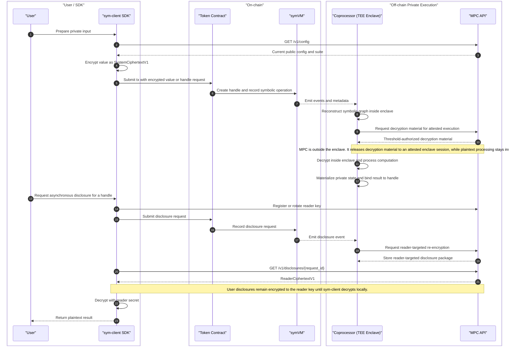

# Symbolic Execution Specifications

`Symbolic Execution` specifies a model for private, composable execution on
Ethereum.

The current design is informed by
[ERC-7984](https://eips.ethereum.org/EIPS/eip-7984): private values appear
on-chain as opaque references, compose across contracts, and are realized
asynchronously off-chain. This repository documents that model, starting from
the contract-facing abstraction and the minimum set of supporting system roles.

## Core Model

Private computation on Ethereum should look like a contract primitive rather
than an external oracle pattern.

That means:

- private values appear on-chain as opaque handles rather than plaintext
- contracts can express operations over those values
- private state can compose across applications
- private execution can happen off-chain while the contract-facing abstraction
  remains stable

## Architecture Modules

The current minimal architecture has four pieces:

- `sym-client`: SDK that prepares private inputs, manages reader keys, and
  receives authorized outputs
- `symVM`: exposes private handles, symbolic operations, and disclosure flows
  on-chain
- `Coprocessor`: resolves symbolic work off-chain
- `MPC`: provides threshold key custody, decryption, re-encryption, and
  related authorization flows

## High-Level Flow

The intended execution split is:

- `sym-client` encrypts user inputs before transactions are submitted on-chain.
- `symVM` records symbolic intent on-chain and the `Coprocessor` listens to its
  events asynchronously.
- private computation happens inside the coprocessor enclave, not inside `MPC`.
- `MPC` stays outside the enclave and handles threshold key operations such as
  decryption authorization, re-encryption to a reader key, and signing.
- user reads are asynchronous: the user asks through `sym-client`, the
  disclosure is prepared through `MPC`, and `sym-client` decrypts the returned
  reader-targeted ciphertext locally.

## Scope

This specification currently focuses on:

- core terminology
- private values and symbolic operations
- how `sym-client`, `symVM`, `Coprocessor`, and `MPC` connect
- operation lifecycle from expression to materialization or disclosure
- permissions for reads and disclosure
- reusable application patterns built on top of the model

## Specs

- [`./sym-client/README.md`](./sym-client/README.md)
- [`./coprocessor/README.md`](./coprocessor/README.md)
- [`./mpc/README.md`](./mpc/README.md)
- [`./symvm/README.md`](./symvm/README.md)
- [`./symvm/symvm-private-handles.md`](./symvm/symvm-private-handles.md)
- [`./symvm/symvm-operations.md`](./symvm/symvm-operations.md)
- [`./symvm/symvm-operation-lifecycle.md`](./symvm/symvm-operation-lifecycle.md)
- [`./symvm/symvm-permissions-and-reads.md`](./symvm/symvm-permissions-and-reads.md)
